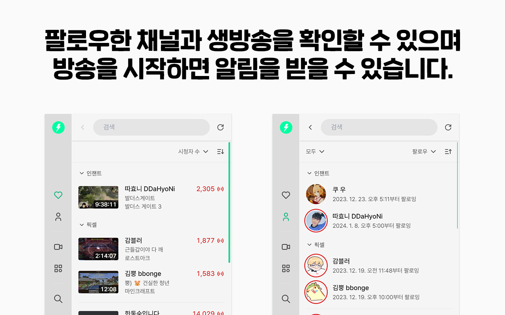

#  Cheese Now

> 치지직 방송 목록 및 알림

[Website](https://www.chz.app/) | [Discord](https://discord.gg/9kq3UNKAkz) | [Chrome Web Store (Chromium, Edge, Whale 호환)](https://chromewebstore.google.com/detail/cemmjndpjenafbjmafgjcpdnfafbkhee) | [Firefox Add-ons](https://addons.mozilla.org/addon/cheese-now/)

팝업을 통해 팔로우한 치지직 채널과 생방송을 확인할 수 있으며, 컬렉션을 통해 팔로우 목록을 정리할 수 있습니다. 더불어 지금 인기 있는 방송과 카테고리를 살펴볼 수 있습니다.

또한, 스트리머가 방송을 시작하거나 카테고리를 변경하면 알림을 받을 수 있습니다.

## Build

Install the dependencies (`yarn install`) and build for the desired platform:

- `yarn build:chrome` if you want to build for Google Chrome
- `yarn build:firefox` if you want to build for Mozilla Firefox

## Frequently Asked Questions

### Why does it break randomly?

Cheese Now can break randomly due to a bug coming from Chromium, which can put the extension in a state of limbo.
This is a known issue, which is unfortunately in the hands of the Chromium team.

- https://bugs.chromium.org/p/chromium/issues/detail?id=1271154

### Are sound notifications supported?

Not officially, Manifest V3 doesn't provide the ability to play audio from a service worker.
Workarounds exist, but aren't worth the trouble.

- https://bugs.chromium.org/p/chromium/issues/detail?id=1131236

## License

Copyright (c) 2022-present Alexandre Breteau 
Copyright (c) 2024 Jebibot

This software is released under the terms of the MIT License.
See the [LICENSE](LICENSE) file for further information.
